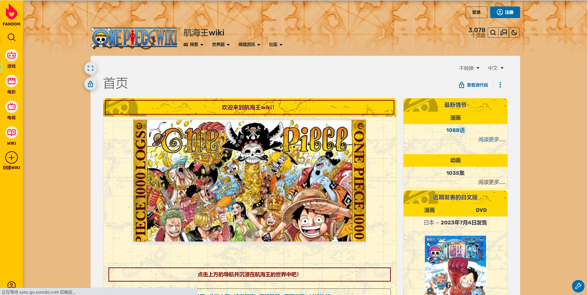
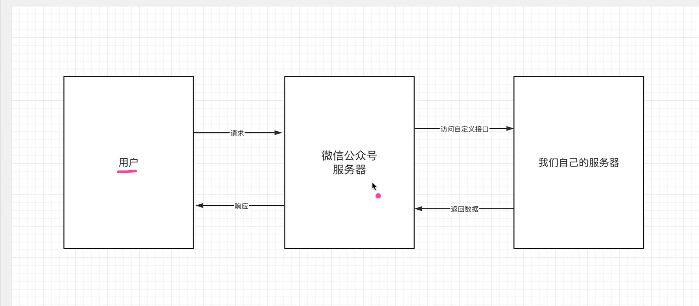
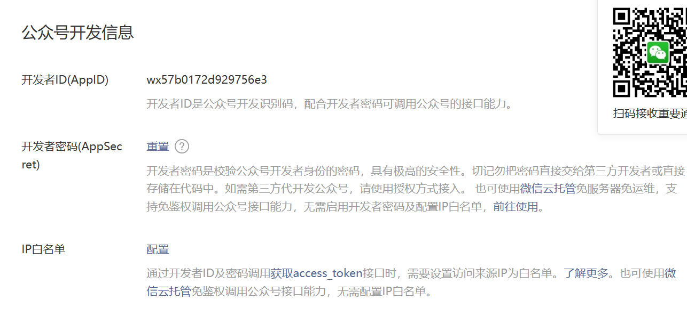
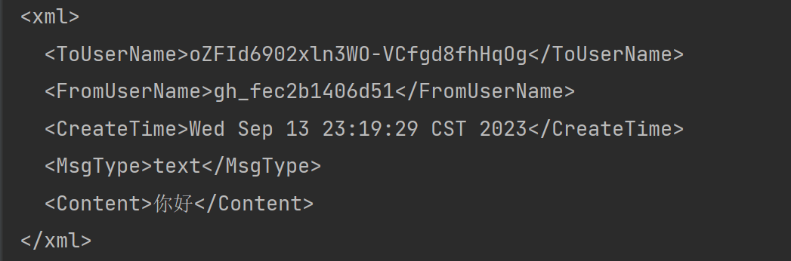
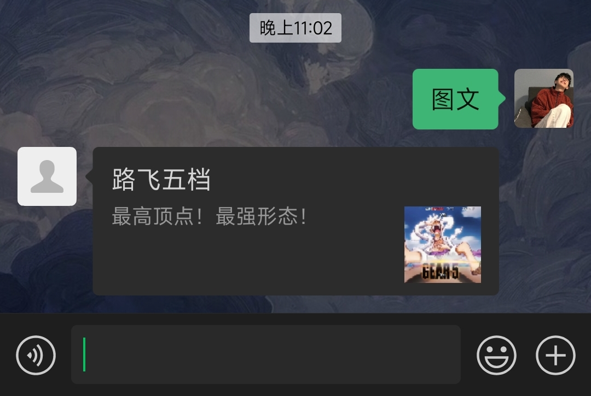

<h1 style="text-align:center">Onepiece中文社区</h1>

网站名称：<span style="color:red">**OnePiece**</span>

抄作业：

[One Piece Wiki | Fandom](https://onepiece.fandom.com/wiki/One_Piece_Wiki)

[TalkOP海道-海贼王论坛-海贼王社区交流-海贼王中文网-航海王论坛-海贼王全集动画漫画讨论 - Powered by Discuz!](https://bbs.talkop.com/)

前言：专为海贼王建立的中文社区网站，任何人可以在这里发布帖子、查阅海贼王的相关信息，主要为宣传海贼王，为所有的海米创建一个“公共基地”。

优势：打破海贼王没有中文网站的缺陷、突破微信或者qq群的人数限制、提供海贼王详细的第一手消息。



## web端

适配手机端、平板、web

### 功能列表

注册：用户的注册

登录：用户的登录（微信登录、qq登录、op账号）

最新情报：漫画、动画的最近报告

超话发表：相当于微博中热搜帖子的发表、可以进行进行点赞、评论、转发

讨论区：讨论某一个话题

素材区域：图片、短视频

海贼王排行榜：人物热度排行版、最爱章节排行版

海贼王历史时间线：[海贼王历史时间表-重要事件汇总 - 知乎 (zhihu.com)](https://zhuanlan.zhihu.com/p/97378992)

## 后台

注册登录功能

## 管理端

内容的审核

海贼王的大数据分析

## web开发

技术栈：html+css+js+ajax+bootstrap

### 页面ico

```
<link rel="shortcut icon" href="./assets/images/logo/logo.ico" type="image/x-icon">
```

> 在header标签中添加

### 关于meta标签

[meta设置编码、关键字、描述、作者、refresh_meta 设置编码_springlan的博客-CSDN博客](https://blog.csdn.net/springlan/article/details/106434164)

### 图标库

[Font Awesome 图标 | 菜鸟教程 (runoob.com)](https://www.runoob.com/font-awesome/fontawesome-tutorial.html)

### 注册登录功能

采用微信扫码或者公众号、QQ、登录的方式

~~·表单方式直接劝退（本人比较厌烦表单）~~

==采用越简单越好的策略==

## 微信公众号开发



`AppSecret`：f0a485a32f0b0392652ce40e9f2c4757

### wx-java-mp

[WxJava微信公众号开发实战 (baobao555.tech)](https://baobao555.tech/archives/53#8.网页授权)

### 基本配置



### 验证消息的确来自微信服务器

```java
List<String> list = Arrays.asList(WxConfigConstant.token, timestamp, nonce);
//排序
Collections.sort(list);
//拼接
StringBuilder builder = new StringBuilder();
for (String s : list) {
    builder.append(s);
}
//进行sha1加密
try {
    MessageDigest sha1 = MessageDigest.getInstance("sha1");
    byte[] digest = sha1.digest(builder.toString().getBytes());
    StringBuilder stringBuilder = new StringBuilder();
    //将加密的数据进行拼接与signature进行比较
    for (byte b : digest) {
        stringBuilder.append(Integer.toHexString((b >> 4) & 15));
        stringBuilder.append(Integer.toHexString(b & 15));
    }
    if (!signature.isEmpty() && signature.equals(stringBuilder.toString())) {
        return echostr;
    }
} catch (NoSuchAlgorithmException e) {
    throw new RuntimeException(e);
}

System.out.println("执行==>" + signature);
return null;
```

### 短信发送功能

当普通微信用户向公众账号发消息时，微信服务器将POST消息的XML数据包到开发者填写的URL上。

接收普通消息需要通过输入流进行接收

#### 解析xml流数据（dom4j）

```xml
<!-- XML 文件读写 -->
<dependency>
    <groupId>org.dom4j</groupId>
    <artifactId>dom4j</artifactId>
    <version>2.0.0</version>
</dependency>
```

将xml输入流解析为map集合

```java
ServletInputStream inputStream = request.getInputStream();
```

`dom4j`:用于读取xml文件输入流的类

```java
HashMap<String, String> msgMap = new HashMap<>();
try {
    //获取文档输入流
    ServletInputStream inputStream = request.getInputStream();
    // dom4j 用于读取 XML 文件输入流的类
    SAXReader saxReader = new SAXReader();
    // 读取 XML 文件输入流, XML 文档对象
    Document document = saxReader.read(inputStream);
    // XML 文件的根节点
    Element root = document.getRootElement();
    // 所有的子节点
    List<Element> childrenElement = root.elements();
    for (Element element : childrenElement) {
        msgMap.put(element.getName(), element.getStringValue());
    }
} catch (Exception e) {
    e.printStackTrace();
}
System.out.println("收到消息"+msgMap);
```

#### 将对象转换为xml字符串

```java
TextMessage textMessage = new TextMessage();
textMessage.setToUserName(msgMap.get("FromUserName"));
textMessage.setFromUserName(msgMap.get("ToUserName"));
textMessage.setCreateTime(new Date().toString());
textMessage.setMsgType("text");
textMessage.setContent("你好");

//将对象转换为xml字符串
XStream xStream = new XStream();
xStream.processAnnotations(TextMessage.class);
String xmlStr = xStream.toXML(textMessage);
System.out.println(xmlStr);
```

```java
@Data
@XStreamAlias("xml")
public class TextMessage extends BaseMessage{

    @XStreamAlias("Content")
    private String content;
}
```

> `XStreamAlias`:设置格式与标签体



### 图文消息的发送



```java
ArticlesMessage articlesMessage = new ArticlesMessage();
articlesMessage.setToUserName(msgMap.get("FromUserName"));
articlesMessage.setFromUserName(msgMap.get("ToUserName"));
articlesMessage.setCreateTime(new Date().toString());
articlesMessage.setMsgType(MessageType.NEWS);
articlesMessage.setArticleCount("1");
ItemMessage itemMessage = new ItemMessage();
itemMessage.setTitle("路飞五档");
itemMessage.setDescription("最高顶点！最强形态！");
itemMessage.setPicUrl("http://mmbiz.qpic.cn/sz_mmbiz_jpg/XTDxMhlYfPgvlPibZ6JfpOc4AWQfAxGOV2AkowLQniaTbbdHpntMVOPwIce88Ww1FZrJInSiaRc1kdico2TwoDvbFQ/0");
itemMessage.setUrl("http://www.onepiece.com");
List<ItemMessage> itemMessages = new ArrayList<>();
itemMessages.add(itemMessage);
articlesMessage.setArticles(itemMessages);
XStream xStream = new XStream();
xStream.processAnnotations(ArticlesMessage.class);
String xmlStr = xStream.toXML(articlesMessage);
System.out.println(xmlStr);
```

### String.format的使用

[String.format()的详细用法 - 知乎 (zhihu.com)](https://zhuanlan.zhihu.com/p/140512054)

### 获取配置文件信息

**获取yml文件中的信息**

1. 在yml配置信息

   ```
   wx:
     app-id: wxacee4a374359e5a0
     app-secret: c341e9a5c1b62c4032dacfaab35f36bb
   ```

2. 创建动态代理

   ```java
   @Data
   @Configuration
   @ConfigurationProperties(prefix = "wx")
   public class WxAccountConfig {
   
       // 公众号ID
       private String appId;
   
       // 公众号secret
       private String appSecret;
   
   }
   ```

3. 依赖注入

   ```java
   @Autowired
   private WxAccountConfig wxAccountConfig;
   ```

参考：[java配置文件取值的几种方式（一般项目，国际化项目，springboot项目）_从配置文件取值_deelless的博客-CSDN博客](https://blog.csdn.net/weixin_43078114/article/details/100559836)

在工具类中获取配置文件中值

### 接入第三方平台

[聚合数据 - API接口开放平台_API接口大全_免费API数据接口服务 (juhe.cn)](https://www.juhe.cn/)

## 后端开发

技术栈：SpringBoot+mybatis+mysql

可能采用maku开源框架

### 公众号扫码登录

使用微信公众号获取登录验证码

### swagger3的配置使用

`maku`平台添加新的模块，需要在主模块中进行引用

[微信公众号之验证码推送(spring-boot+测试号)_微信公众号发送验证码怎么实现_ctrlcaster的博客-CSDN博客](https://blog.csdn.net/qq_18804633/article/details/124239446)

[微信公众号开发--实现扫码关注公众号自动登录网站_关注公众号登录网站_给变量取个好名吖的博客-CSDN博客](https://blog.csdn.net/qq_45145801/article/details/115368296)

## 管理端开发

技术栈：Vue2+element-ui

## 问题总结

### 前端页面布局


h5+css完成页面的布局

https://www.bilibili.com/video/BV11741177cJ/?spm_id_from=333.1007.top_right_bar_window_history.content.click&vd_source=7d2190e3d81751e1c303328c9259bb59

### 多端适配

### web端登录注册

